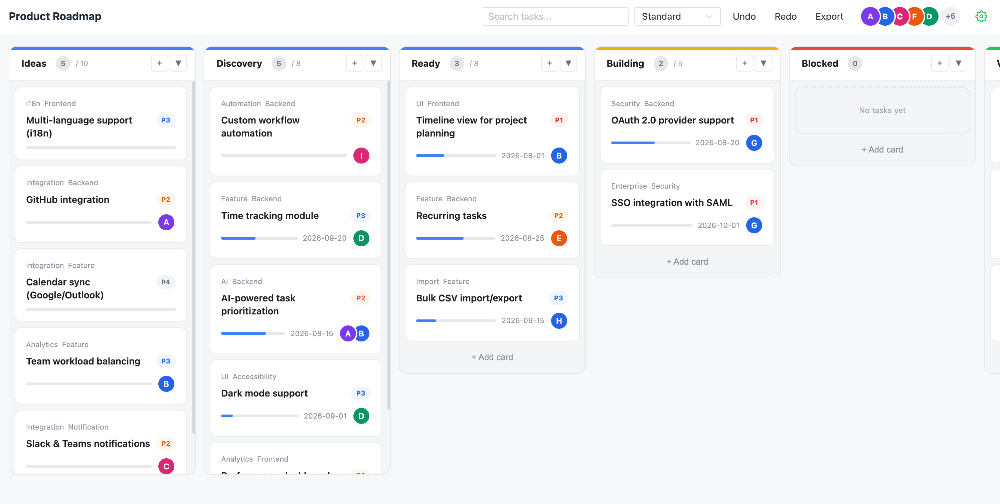

# TaskBoard Vue 3 Component

基于 Vue 3 + Naive UI 实现的任务看板组件，支持拖拽排序、列管理、多参与人等完整的看板功能。

## 功能特性

- **看板视图**：多列横向滚动，列可折叠/展开
- **列头编辑**：点击列头标签编辑名称，支持 16 色预设 + 自定义颜色，顶部横条即时生效
- **列拖拽排序**：拖动列头交换列位置，蓝色竖线指示目标位置
- **卡片管理**：添加/编辑/删除/复制卡片
- **卡片拖拽**：卡片跨列拖拽排序
- **多参与人**：每张卡片支持 NSelect 多选下拉分配多个参与人，卡片和工具栏显示堆叠头像
- **搜索过滤**：按标题、描述、标签、参与人姓名搜索
- **撤销/重做**：完整的操作历史，支持 Ctrl+Z / Ctrl+Shift+Z
- **导出功能**：支持 JSON 和 CSV 导出
- **右键菜单**：卡片右键菜单（编辑/复制/删除）
- **键盘导航**：方向键在列和卡片间导航
- **WIP 限制**：列的进行中任务数上限，超标时红色横条高亮提醒
- **密度切换**：Compact / Standard / Comfortable 三种密度
- **主题色定制**：CSS 变量驱动，改一处全局生效

## 效果预览



## 快速开始

### 安装

```bash
npm install
```

### 开发运行

```bash
npm run dev
```

### 构建

```bash
npm run build
```

## 组件结构

```
src/
├── components/
│   ├── TaskBoardRoot.vue     # 根容器，控制密度样式
│   ├── TaskBoardContent.vue  # 工具栏 + 列容器
│   ├── TaskBoardColumn.vue   # 单个列（列头 + 卡片列表）
│   └── TaskBoardCard.vue     # 单个卡片
├── composables/
│   └── useTaskBoard.ts       # 核心状态管理（列/卡片/拖拽/撤销等）
├── types/
│   └── taskboard.ts          # TypeScript 类型定义
└── styles/
    └── taskboard.css         # 全部样式
```

## 使用方式

### 1. 引入类型和 composable

```typescript
import { useTaskBoard } from './composables/useTaskBoard'
import type { TaskBoardColumn, TaskBoardItem } from './types/taskboard'
```

### 2. 定义列和数据

```typescript
const columns: TaskBoardColumn[] = [
  { id: 'todo', label: '待办', statusType: 'todo', wipLimit: 5, collapsed: false, order: 0 },
  { id: 'doing', label: '进行中', statusType: 'in-progress', wipLimit: 3, collapsed: false, order: 1 },
  { id: 'done', label: '已完成', statusType: 'done', collapsed: false, order: 2 },
]

const tasks: TaskBoardItem[] = [
  {
    id: '1',
    title: '用户登录页面',
    description: '实现登录页面 UI 和逻辑',
    priority: 'P1',
    tags: ['UI', '前端'],
    assignees: [{ name: '张三' }, { name: '李四' }],
    progress: 60,
    dueDate: '2026-08-15',
    columnId: 'doing',
    order: 0,
  },
]
```

### 3. 初始化 composable

```typescript
const board = useTaskBoard(columns, tasks)
```

### 4. 模板中使用

```html
<TaskBoardRoot :density="board.density.value">
  <TaskBoardContent
    :columns="board.columns.value"
    :search-query="board.searchQuery.value"
    :density="board.density.value"
    :tasks-count="board.tasks.value.length"
    :tasks="board.tasks.value"
    @update:search-query="board.searchQuery.value = $event"
    @change-density="(d) => board.setDensity(d)"
    @download-json="board.downloadJSON()"
    @download-csv="board.downloadCSV()"
    @undo="board.undo()"
    @redo="board.redo()"
  >
    <TaskBoardColumnComp
      v-for="(col, idx) in board.columns.value"
      :key="col.id"
      :column="col"
      :tasks="board.getColumnTasks(col.id)"
      :drag-state="board.dragState"
      :column-drag-state="board.columnDragState"
      :selected-task-ids="board.selectedTaskIds.value"
      :is-wip-exceeded="board.isWipExceeded(col)"
      :column-index="idx"
      @toggle-collapse="board.toggleColumnCollapse"
      @add-task="openAddModal"
      @drag-start="board.onDragStart"
      @drag-over="board.onDragOver"
      @drop="board.onDrop"
      @drag-end="board.onDragEnd"
      @select="board.toggleSelect"
      @context-menu="board.showContextMenu"
      @edit="openEditModal"
      @column-drag-start="board.onColumnDragStart"
      @column-drag-over="board.onColumnDragOver"
      @column-drop="board.onColumnDrop"
      @column-drag-end="board.onColumnDragEnd"
    />
  </TaskBoardContent>
</TaskBoardRoot>
```

## API 参考

### useTaskBoard 返回值

| 属性/方法 | 类型 | 说明 |
|---|---|---|
| `columns` | `Ref<TaskBoardColumn[]>` | 列列表 |
| `tasks` | `Ref<TaskBoardItem[]>` | 全部任务 |
| `searchQuery` | `Ref<string>` | 搜索关键词 |
| `density` | `Ref<TaskBoardDensity>` | 当前密度 |
| `filteredTasks` | `ComputedRef<TaskBoardItem[]>` | 过滤后的任务 |
| `getColumnTasks(columnId)` | `(id: string) => TaskBoardItem[]` | 获取某列任务 |
| `addTask(colId, partial)` | 方法 | 添加任务 |
| `updateTask(id, updates)` | 方法 | 更新任务 |
| `deleteTask(id)` | 方法 | 删除任务 |
| `toggleColumnCollapse(id)` | 方法 | 折叠/展开列 |
| `updateColumn(id, updates)` | 方法 | 编辑列名称和颜色 |
| `setDensity(d)` | 方法 | 切换密度 |
| `onDragStart/Over/Drop/End` | 方法 | 卡片拖拽 |
| `onColumnDragStart/Over/Drop/End` | 方法 | 列拖拽 |
| `undo()` / `redo()` | 方法 | 撤销/重做 |
| `downloadJSON()` / `downloadCSV()` | 方法 | 导出 |
| `exportToJSON()` / `exportToCSV()` | 方法 | 导出为字符串 |

### 类型定义

| 类型 | 字段 |
|---|---|
| `TaskBoardStatus` | `'todo' \| 'in-progress' \| 'done' \| 'blocked'` |
| `TaskBoardPriority` | `'P1' \| 'P2' \| 'P3' \| 'P4'` |
| `TaskBoardDensity` | `'compact' \| 'standard' \| 'comfortable'` |
| `TaskBoardAssignee` | `{ name: string; avatar?: string }` |
| `TaskBoardItem` | `id, title, description, priority, tags, assignees, progress, dueDate, columnId, order` |
| `TaskBoardColumn` | `id, label, statusType, wipLimit?, collapsed, order, color?` |

### 主题定制

通过 CSS 变量修改主题色，在 `taskboard.css` 的 `:root` 中：

```css
:root {
  --tb-theme-primary: #3b82f6;   /* 主色调 */
  --tb-theme-success: #22c55e;   /* 成功色 */
  --tb-theme-warning: #eab308;   /* 警告色 */
  --tb-theme-danger: #ef4444;    /* 危险色 */
}
```

## 技术栈

- Vue 3 + TypeScript
- Vite 5
- Naive UI 2
- @vueuse/core
- uuid
